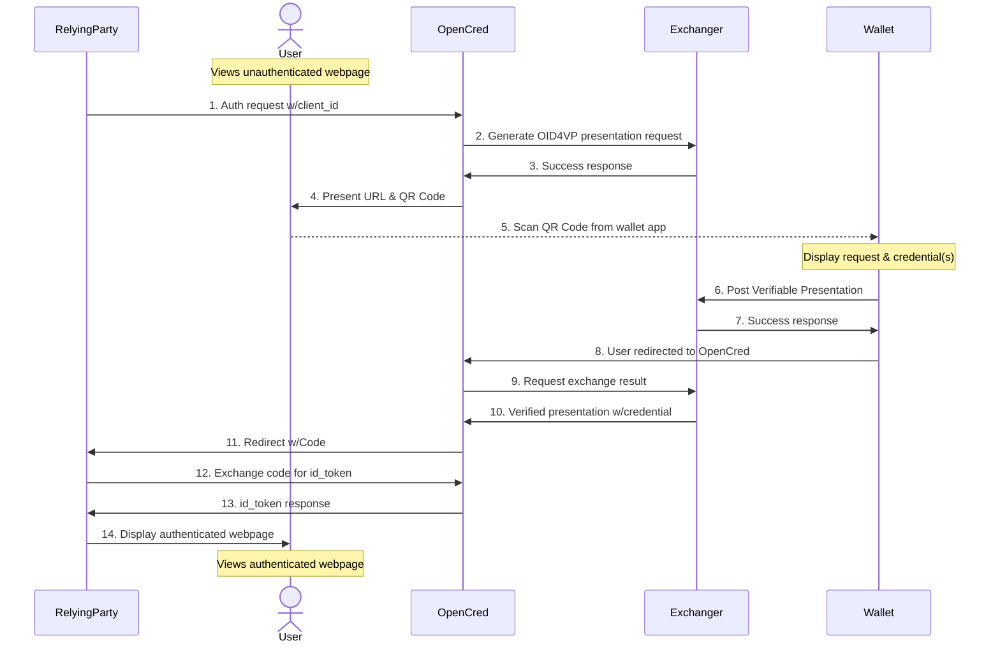

# OpenCred: The Open Credentials Platform

OpenCred is an open source credential verification platform that allows relying
party services to request claims about users over an OpenID Connect-style
redirection workflow where the claims are verified via a user presenting them
within a credential that meets certain requirements.

An OIDC4CVP workflow is embedded within a OIDC authentication workflow. This app
is responsible for the inner OIDC4CVP workflow. It returns an OIDC ID token to
the relying party service or an error.



# Architecture

This app uses a node express server to render a Vue 3 app first in SSR mode on
the server and then hydrated on the client. The Vue app is compiled with Vite
into server and client-side entry points. The methodology is based on this
[example](https://github.com/vitejs/vite-plugin-vue/tree/main/playground/ssr-vue).

It doesn't yet support hot-reloading for UI component changes integrated with
the express app. (Example
[isProd](https://github.com/vitejs/vite-plugin-vue/blob/main/playground/ssr-vue/server.js#L36)
checks could be added to set up a vite server). To see changes, you must stop
the server, rebuild the UI, and restart the server, as with `npm run build &&
npm run start`.

## Usage

### Configuration

The app is configured via a YAML file. See
[config/config.example.yaml](config/config.example.yaml) for an example.

Copy the example to the ignored location `cp config/config.example.yaml
config/config.yaml` and edit the file. Configure the details of your relying
party, and connection details for a VC-API exchanger endpoint

#### Configuring a Native workflow

Update the `relyingParties` section of the config file to include a relying
party with a workflow of type `native`. The `native` workflow type is used to
implement a VC-API exchange on this instance of OpenCred. This results in a QR
code being displayed to the user or returned through the initiate exchange API 
endpoint that can be scanned by a wallet app. The wallet app will then present
the user with a list of credentials that can be used to satisfy the request.

#### Configuring did:web endpoint
You can use OpenCred as a did:web endpoint by configuring the `didWeb` section
of the config file. The following would result in a DID document being
published for the did `did:web:example.com`. The document would be available
from OpenCred at `/.well-known/did.json`. If domain linkage support is supported, you can find that document at `/.well-known/did-configuration.json`.

```yaml
didWeb:
  mainEnabled: true
  linkageEnabled: true
  mainDocument: >
    {
      "id": "did:web:example.com",
      "@context": [
        "https://www.w3.org/ns/did/v1",
        {
          "@base": "did:web:example.com"
        }
      ],
      "service": [
        {
          "id": "#linkeddomains",
          "type": "LinkedDomains",
          "serviceEndpoint": {
            "origins": [
              "https://example.com"
            ]
          }
        },
        {
          "id": "#hub",
          "type": "IdentityHub",
          "serviceEndpoint": {
            "instances": [
              "https://hub.did.msidentity.com/v1.0/test-instance-id"
            ]
          }
        }
      ],
      "verificationMethod": [
        {
          "id": "test-signing-key",
          "controller": "did:web:example.com",
          "type": "EcdsaSecp256k1VerificationKey2019",
          "publicKeyJwk": {
            "crv": "secp256k1",
            "kty": "EC",
            "x": "test-x",
            "y": "test-y"
          }
        }
      ],
      "authentication": [
        "test-signing-key"
      ],
      "assertionMethod": [
        "test-signing-key"
      ]
    }
  linkageDocument: >
    {
      "@context": "https://identity.foundation/.well-known/did-configuration/v1",
      "linked_dids": ["eyJhbGciOiJFZERTQSIsImtpZCI6ImRpZDprZXk6ejZNa29USHNnTk5yYnk4SnpDTlExaVJMeVc1UVE2UjhYdXU2QUE4aWdHck1WUFVNI3o2TWtvVEhzZ05OcmJ5OEp6Q05RMWlSTHlXNVFRNlI4WHV1NkFBOGlnR3JNVlBVTSJ9.eyJleHAiOjE3NjQ4NzkxMzksImlzcyI6ImRpZDprZXk6ejZNa29USHNnTk5yYnk4SnpDTlExaVJMeVc1UVE2UjhYdXU2QUE4aWdHck1WUFVNIiwibmJmIjoxNjA3MTEyNzM5LCJzdWIiOiJkaWQ6a2V5Ono2TWtvVEhzZ05OcmJ5OEp6Q05RMWlSTHlXNVFRNlI4WHV1NkFBOGlnR3JNVlBVTSIsInZjIjp7IkBjb250ZXh0IjpbImh0dHBzOi8vd3d3LnczLm9yZy8yMDE4L2NyZWRlbnRpYWxzL3YxIiwiaHR0cHM6Ly9pZGVudGl0eS5mb3VuZGF0aW9uLy53ZWxsLWtub3duL2RpZC1jb25maWd1cmF0aW9uL3YxIl0sImNyZWRlbnRpYWxTdWJqZWN0Ijp7ImlkIjoiZGlkOmtleTp6Nk1rb1RIc2dOTnJieThKekNOUTFpUkx5VzVRUTZSOFh1dTZBQThpZ0dyTVZQVU0iLCJvcmlnaW4iOiJpZGVudGl0eS5mb3VuZGF0aW9uIn0sImV4cGlyYXRpb25EYXRlIjoiMjAyNS0xMi0wNFQxNDoxMjoxOS0wNjowMCIsImlzc3VhbmNlRGF0ZSI6IjIwMjAtMTItMDRUMTQ6MTI6MTktMDY6MDAiLCJpc3N1ZXIiOiJkaWQ6a2V5Ono2TWtvVEhzZ05OcmJ5OEp6Q05RMWlSTHlXNVFRNlI4WHV1NkFBOGlnR3JNVlBVTSIsInR5cGUiOlsiVmVyaWZpYWJsZUNyZWRlbnRpYWwiLCJEb21haW5MaW5rYWdlQ3JlZGVudGlhbCJdfX0.aUFNReA4R5rcX_oYm3sPXqWtso_gjPHnWZsB6pWcGv6m3K8-4JIAvFov3ZTM8HxPOrOL17Qf4vBFdY9oK0HeCQ"]
    }
```

### Configuring OIDC Token Signing Key

You may enter key information in the `signingKeys` section of the config, and
the public keys will be published in the `./well-known/jwks.json` endpoint for
keys with the `id_token` purpose. 

Supported key types for id_token signing include: 

JWT alg `ES256`: generate a seed with `npm run generate:prime256v1`.

```yaml
signingKeys: 
  - type: Ed25519VerificationKey2020
    seed: z1AkD6Wv5tKQdCTFJMEmF9vDJaa4V6f44jUasJPyn6RqdFZ
    purpose: 
      - id_token
```

### Run via node

Prerequisites: 

* Node v20
* MongoDB: configure e.g. `dbConnectionUri: mongodb://localhost:27017`

Install dependencies, compile the UI, and run the server:

```sh
$ npm i
$ npm run build
$ npm run start
```

### Run via Docker

You can build and run the server via Docker mounting your local configuration
file with the following commands. `$PWD` substitution is the expected format for
current working directory unix/bash/zsh, Substitute your actual project root
path for other systems.

```sh
$ docker build . -t opencred-platform
$ docker run -d -p 8080:8080 -v $PWD/config:/etc/app-config opencred-platform
$ curl http://localhost:8080/health
```

## License

BSD-3-Clause
