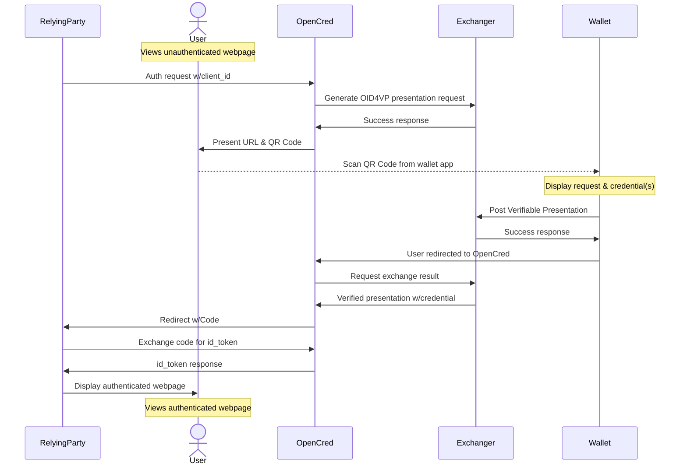

# OpenCred: The Open Credentials Platform

OpenCred is an open source credential verification platform that allows relying party 
services to request claims about users over an OpenID Connect-style redirection
workflow where the claims are verified via a user presenting them within a 
credential that meets certain requirements.

An OIDC4CVP workflow is embedded within a OIDC authentication workflow. This app
is responsible for the inner OIDC4CVP workflow. It returns an OIDC ID token to
the relying party service or an error.




## Usage

### Directly via node

Node v20 is used for this project.

Install dependencies and run the server:

```sh
$ npm i
$ node index.js
```

### via Docker

```sh
$ docker build . -t opencred-platform
$ docker run -p 8080:8080 -d opencred-platform
$ curl http://localhost:8080/health
```

## License

BSD-3-Clause
